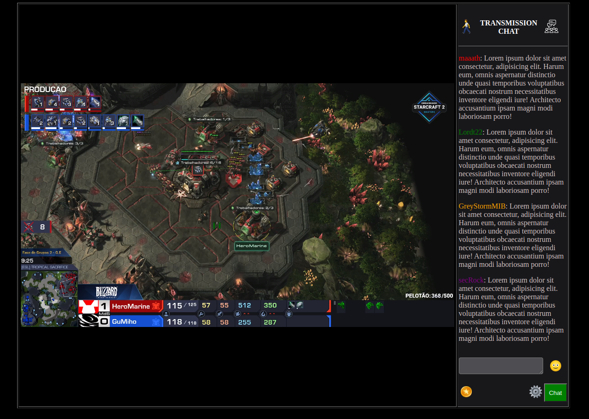

# Twitch clone html

## About

This project aims to create a clone of Twitch. It is when one are watching a stream in theater mode.

The main objective is practice frontend skills.

The project was developed using the old methodology: buildign a webpage using table structure.

***Base course: Devplay - Um Novo Jeito De Programar***

## Result

